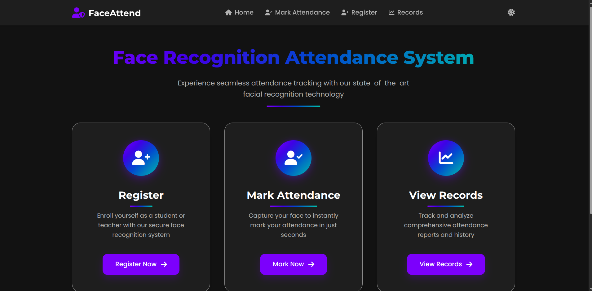
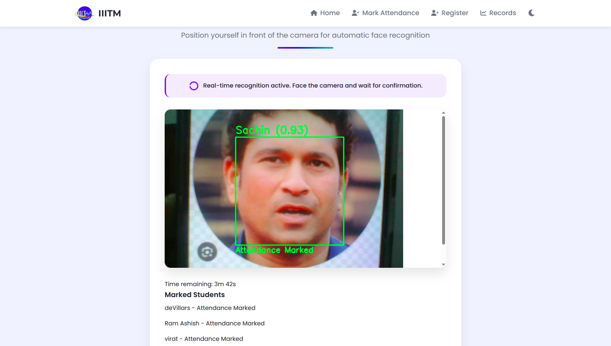
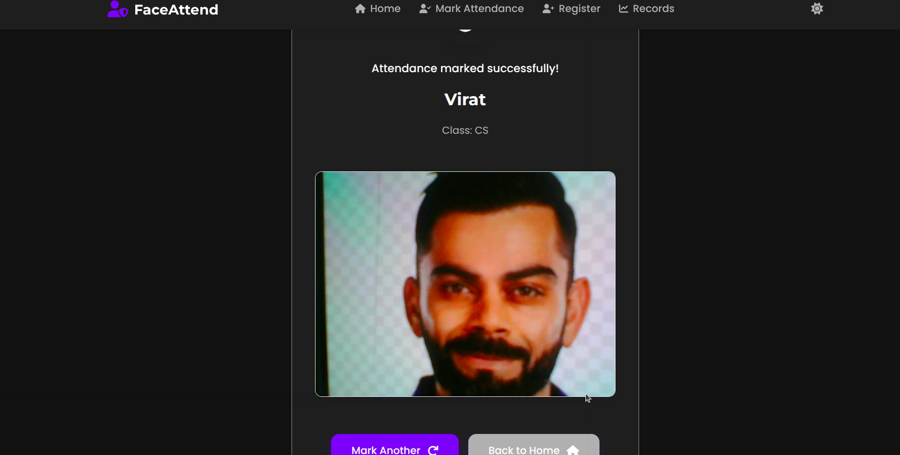
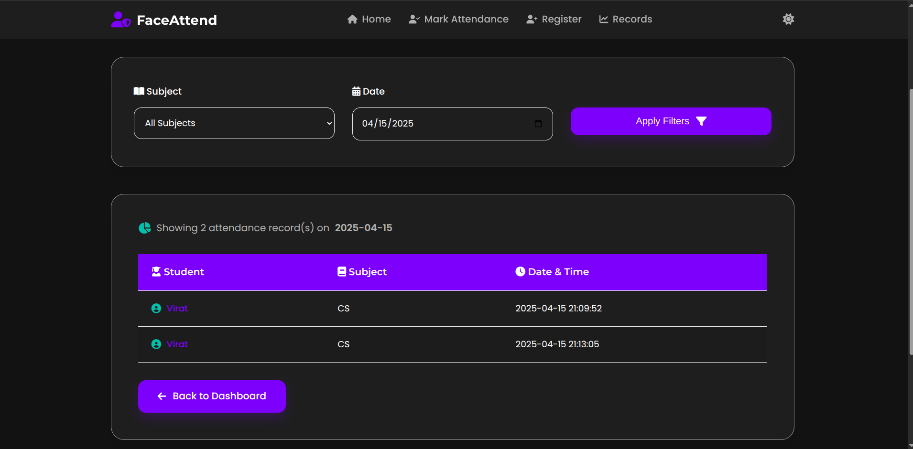

# 👤 Face Recognition Attendance System

> Automate attendance tracking using computer vision and deep learning






## ✨ Features

- 📹 Real-time face detection using MediaPipe
- 🔍 Advanced face recognition with DeepFace
- ⏱️ Automatic attendance marking with timestamps
- 👥 Support for multiple faces/students
- 🖥️ Simple and intuitive user interface

## 🛠️ Technologies Used

- Python 3.x
- OpenCV
- MediaPipe
- DeepFace
- Pandas (for CSV handling)

## 📋 Installation

### Prerequisites

- Python 3.7 or higher
- pip package manager

### Setup Steps

1. **Clone the repository:**
   ```bash
   git clone https://github.com/your-username/face-recognition-attendance-system.git
   cd face-recognition-attendance-system
   ```

2. **Install the required packages:**
   ```bash
   pip install -r requirements.txt
   ```

3. **Prepare Configs:**
   - Setup the Firebase

## 🚀 Usage

1. **Run the application:**
   ```bash
   python app.py
   ```

2. **Available features:**
   - To add a new face to the database
   - To mark attendance
   - To view attendance result

## 🤝 Contributing

Contributions are welcome! Please follow these steps:

1. Fork the project
2. Create your feature branch (`git checkout -b feature/AmazingFeature`)
3. Commit your changes (`git commit -m 'Add some amazing feature'`)
4. Push to the branch (`git push origin feature/AmazingFeature`)
5. Open a Pull Request

## 📄 License

Distributed under the MIT License. See `LICENSE` for more information.

## 📞 Contact

Ram - ray09112004@gmail.com

Project Link: https://github.com/ramashishyadav108/Face-Recognition-Attendance-System-usingMediaPipe-and-DeepFace

## 🙏 Acknowledgments

- MediaPipe team for the excellent face detection solution
- DeepFace developers for the powerful face recognition framework
- OpenCV community for computer vision tools

---

## 📸 Demo

### How it works

1. **Face Detection**: The system first detects faces in the camera feed using MediaPipe's face detection model
2. **Face Recognition**: Detected faces are then compared with the faces in the database using DeepFace
3. **Attendance Marking**: When a match is found, attendance is marked with a timestamp

### Sample Output

